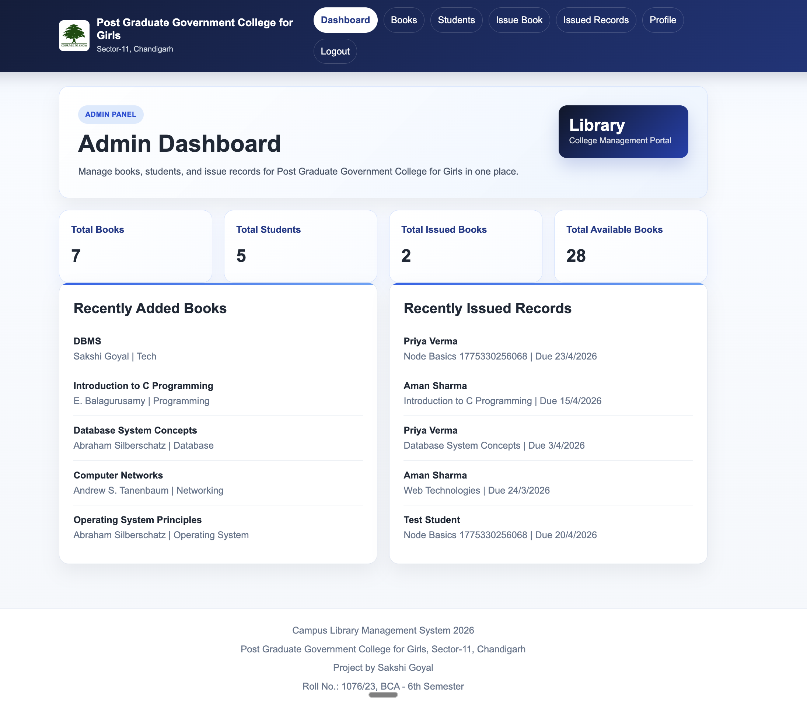

# Campus Library Management System

Campus Library Management System is a full-stack web application for managing books, students, and issue-return workflows in a college library. The application runs on Node.js and Express, stores data in SQLite, and serves a multi-page frontend built with HTML, CSS, and vanilla JavaScript.

## Live Deployment

- App URL: `https://library-management-system-n79m.onrender.com`
- Health check: `https://library-management-system-n79m.onrender.com/api/health`

## Application Screenshot

<p align="center">
  
</p>

<p align="center">
  
</p>

<p align="center">
  
</p>

<p align="center">
  
</p>

<p align="center">
  
</p>

<p align="center">
  
</p>

<p align="center">
  
</p>

## Core Features

- Admin and student authentication with JWT
- Student self-registration
- Role-based access control
- Book catalog search and category filtering
- Add, edit, and delete book records
- Student list and student detail view for admins
- Book issue and return workflow
- Student-issued-books view
- Profile management
- Automatic overdue flagging for active issues past the due date

## Tech Stack

- Frontend: HTML, CSS, JavaScript
- Backend: Node.js, Express.js
- Database: SQLite
- Authentication: JWT, bcryptjs
- Utilities: CORS, dotenv

## Current Project Structure

```text
library-managment-system/
├── backend/
│   ├── config/
│   │   └── db.js
│   ├── controllers/
│   │   ├── authController.js
│   │   ├── bookController.js
│   │   ├── issueController.js
│   │   └── userController.js
│   ├── database/
│   │   ├── library.db
│   │   ├── schema.sql
│   │   └── seed.sql
│   ├── middleware/
│   │   ├── authMiddleware.js
│   │   └── roleMiddleware.js
│   ├── routes/
│   │   ├── authRoutes.js
│   │   ├── bookRoutes.js
│   │   ├── issueRoutes.js
│   │   └── userRoutes.js
│   ├── utils/
│   │   └── generateToken.js
│   └── server.js
├── documentation/
│   ├── md/
│   └── pdf/
├── public/
│   ├── assets/
│   ├── css/
│   ├── js/
│   └── *.html
├── report/
│   ├── code-explanation.md
│   ├── report.md
│   └── screenshots/
├── package-lock.json
├── package.json
└── server.js
```

## Runtime Architecture

- Root `server.js` is the deployment entrypoint.
- `backend/server.js` creates the Express app and serves `public/`.
- `public/` contains the active frontend that is delivered to browsers.
- `backend/routes/` defines API endpoints.
- `backend/controllers/` contains request handling and business rules.
- `backend/middleware/` verifies authentication and roles.
- `backend/config/db.js` initializes SQLite, schema setup, and seed data.
- `backend/database/library.db` is the default runtime database file.

## Default Accounts

### Admin

- Email: `admin@library.com`
- Password: `admin123`

### Sample Students

- Password: `student123`
- Emails:
  - `aman.sharma@example.com`
  - `priya.verma@example.com`
  - `rohit.singh@example.com`
  - `neha.gupta@example.com`

## Local Setup

1. Install dependencies:

```bash
npm install
```

2. Start the application:

```bash
npm run dev
```

Or:

```bash
npm start
```

3. Open the app:

```text
http://localhost:5000
```

## Environment Variables

- `PORT`: optional; defaults to `5000`
- `JWT_SECRET`: required for authentication
- `DB_PATH`: optional; defaults to `backend/database/library.db`

Example:

```bash
JWT_SECRET=replace-with-a-secure-secret npm start
```

## Database Notes

- Schema file: `backend/database/schema.sql`
- Seed file: `backend/database/seed.sql`
- Default database file: `backend/database/library.db`

On startup the application:

- creates tables if they do not exist
- seeds the admin account if missing
- inserts sample students, books, and issue records when missing

## API Overview

### Auth

- `POST /api/auth/register`
- `POST /api/auth/login`
- `GET /api/auth/me`

### Books

- `GET /api/books`
- `GET /api/books/:id`
- `POST /api/books`
- `PUT /api/books/:id`
- `DELETE /api/books/:id`

### Users

- `GET /api/users/students`
- `GET /api/users/students/:id`
- `PUT /api/users/profile`
- `DELETE /api/users/students/:id`

### Issues

- `POST /api/issues`
- `GET /api/issues`
- `GET /api/issues/my`
- `PUT /api/issues/:id/return`

## Documentation

- Learning documentation lives in `documentation/md/`
- Generated PDFs live in `documentation/pdf/`
- Submission material lives in `report/`
