<style>
pre { background: #ffffff !important; border: 1px solid #000000; padding: 12px; overflow-x: auto; }
code { background: #ffffff !important; }
</style>

# LIBRARY MANAGEMENT SYSTEM

**Submitted By:** Sakshi Goyal  
**Roll No.:** 1076/23  
**Course:** Bachelor of Computer Applications  
**College:** Post Graduate Government College for Girls, Sector-11, Chandigarh  
**University:** Panjab University, Chandigarh  
**Session:** 2024-2025  
**Project Guide:** Lt. Harpreet Kaur

---

# COVER PAGE

<div align="center">

## Post Graduate Government College for Girls, Sector-11, Chandigarh
### Panjab University, Chandigarh
### Session: 2024-2025

<br>

## Major Project Report
## On
## **Library Management System**

<br>

### Submitted By
**Sakshi Goyal**  
**Roll No.: 1076/23**

<br>

### Submitted To
**Project Guide: Lt. Harpreet Kaur**

</div>

---

# CERTIFICATE

This is to certify that the project entitled **"Library Management System"** has been successfully completed by **Sakshi Goyal (Roll No. 1076/23)** under my supervision and guidance.

This project is submitted in partial fulfillment of the requirements for the award of the degree of **Bachelor of Computer Applications** from **Panjab University, Chandigarh**.

The work presented in this report is original and has been carried out by the candidate with sincerity and dedication. To the best of my knowledge, this work has not been submitted previously for any academic award.

**Project Guide**  
Lt. Harpreet Kaur  
Assistant Professor  
Department of Computer Applications

---

# SELF DECLARATION

I hereby declare that the project report titled **"Library Management System"** submitted by me is a genuine record of the work carried out by me under the supervision of **Lt. Harpreet Kaur**.

This project is submitted in partial fulfillment of the requirements for the award of the degree of **Bachelor of Computer Applications** from **Post Graduate Government College for Girls, Sector-11, Chandigarh**.

I further declare that this work has not been submitted earlier for the award of any other degree or diploma in any institution.

**Student Name:** Sakshi Goyal  
**Roll No.:** 1076/23

---

# ACKNOWLEDGEMENT

I express my sincere gratitude to **Lt. Harpreet Kaur**, Assistant Professor, for her valuable guidance, continuous support, and encouragement throughout the development of this project. Her insightful suggestions and constructive feedback played a vital role in the successful completion of this work.

I would also like to extend my appreciation to our respected Principal and faculty members for providing a supportive academic environment and the necessary resources for carrying out this project successfully.

I am thankful to my peers and friends for their cooperation, motivation, and helpful suggestions during the project development phase.

Finally, I acknowledge all those who directly or indirectly contributed to the completion of this project.

---

# TABLE OF CONTENTS

1. Synopsis  
2. Introduction  
3. Technology Overview  
4. Tools Used  
5. System Requirements  
6. Project Architecture Diagram  
7. Database Design  
8. Project Modules  
9. Folder Structure  
10. Code Explanation  
11. How To Run This Project  
12. Screenshots  
13. Advantages  
14. Limitations  
15. Future Scope  
16. Conclusion  
17. Bibliography

---

# SYNOPSIS

## Project Overview

The **Library Management System** is a web-based application developed to manage the routine activities of a college library in a simple, organized, and efficient manner. The project provides separate access for administrators and students, allowing both types of users to perform their required tasks through a user-friendly interface. The main purpose of the system is to reduce manual paperwork and improve the management of books, student records, and issue-return transactions.

The system has been designed as a full-stack application with a clear separation between the frontend and the backend. The frontend is developed using HTML, CSS, and JavaScript to provide an easy-to-use interface. The backend is developed using Node.js and Express.js to handle business logic, authentication, and data processing. All records are stored in a relational database so that information remains structured and accessible.

This project supports essential library functions such as student registration, login, role-based access, book management, student management, issue of books, return of books, and profile management. The administrator can control the complete library process, while students can search books, view available records, and monitor their own issued books. The project is suitable for a college-level academic environment because it solves a practical problem in a clear and understandable manner.

## Need of the Project

In many educational institutions, library activities are still maintained using registers, notebooks, and manual entries. This approach creates several operational difficulties and reduces efficiency. The need for this project arises from the following problems:

- Manual systems are time-consuming and require repeated paperwork.
- There are high chances of human error while recording issue and return entries.
- Book availability cannot be checked quickly when records are handled manually.
- It becomes difficult to track student-wise issue history and due dates.
- Updating, searching, and verifying records consumes unnecessary time.
- Manual record handling becomes less effective as the number of books and students increases.

## Objectives

The major objectives of this project are:

- To automate the daily operations of a college library.
- To maintain accurate and well-organized records of books and students.
- To provide quick access to book and issue information.
- To reduce manual effort and paperwork in library management.
- To implement role-based access for admin and student users.
- To create a system that is simple to use, easy to explain, and practical for real academic use.

---

# INTRODUCTION

The library is one of the most important academic resources in any educational institution. It supports students and teachers by providing access to books, reference materials, and subject-related learning content. Proper management of library activities is necessary to ensure that books are issued correctly, returned on time, and recorded accurately. For this purpose, a Library Management System plays a very important role in improving efficiency and maintaining discipline in record handling.

## Overview of Library Management System

The Library Management System developed in this project is a web-based software application that helps manage library operations digitally. It allows the administrator to maintain the collection of books, manage student information, issue books, record returns, and view summary data through a dashboard. It also allows students to register themselves, log in to the system, search books, view their issued books, and update their profile details.

The system has been developed with the aim of making library operations more systematic and less dependent on paper-based processes. The project includes separate modules for administrator and student users so that access is secure and tasks remain role-specific.

## Description of Existing Manual System

In the existing manual system, library records are usually maintained in notebooks, ledgers, or separate files. The librarian manually records details such as student name, roll number, book title, issue date, and return date. Whenever a student wants to check whether a book is available, the librarian has to search the records manually. Similarly, preparing reports or finding overdue books becomes difficult and time-consuming.

Manual handling of records is manageable only when the number of books and users is very limited. In a college environment where many students access the library, the manual method often leads to delays, mistakes, and poor record organization.

## Limitations of Existing System

The manual system has several limitations:

- Record searching is slow and inconvenient.
- Data duplication and writing mistakes are common.
- It is difficult to know the exact number of available books at any time.
- Monitoring issued and returned books requires extra effort.
- Student details and issue history are not easy to retrieve quickly.
- Report preparation and status checking are not efficient.
- Security and access control are weak because records are not protected by user roles.

## Proposed System Advantages

The proposed Library Management System overcomes many limitations of the manual process. It provides a digital platform where all important records are stored in a structured database and can be accessed quickly. Authentication is used to identify users, and role-based access ensures that admin and student users see only the features meant for them.

The system helps the administrator manage books and students more efficiently. It automatically updates book availability when a book is issued or returned. Students can view book details and their issued records without depending entirely on manual assistance. The project therefore improves speed, accuracy, transparency, and convenience in the management of library activities.

---

# TECHNOLOGY OVERVIEW

## HTML (Structure)

HTML is used to create the basic structure of all pages in the system. It defines the layout of forms, tables, navigation bars, dashboard sections, and content blocks. In this project, HTML pages are used for login, registration, dashboards, book management, student records, and profile pages. It provides a simple and readable page structure that is easy to maintain and explain.

## CSS (Styling)

CSS is used to design the visual appearance of the application. It controls colors, spacing, buttons, tables, cards, forms, and responsive layout behavior. In this project, CSS helps create a clean and professional interface suitable for a college-level management system. Separate CSS files are used for different page types so that the design remains organized and easy to update.

## JavaScript (Client-side logic)

JavaScript is used to handle the interactive behavior of the frontend. It manages form submissions, API calls, message display, page redirection, local storage handling, and dynamic data rendering. In this project, JavaScript connects the user interface with backend services through the Fetch API. It makes the application responsive and reduces the need for manual page refresh logic.

## Node.js (Runtime environment)

Node.js is the runtime environment used to execute JavaScript on the server side. It allows the backend to process requests, run server code, and connect with the database. In this project, Node.js is used to build the server environment for handling authentication, book operations, student management, and issue-return functions. It is suitable for this project because it is simple, efficient, and works well with JavaScript-based development.

## Express.js (Backend framework)

Express.js is a lightweight web framework built on top of Node.js. It is used to create routes, manage middleware, process requests, and send responses to the frontend. In this project, Express.js is used to organize backend functionality into routes and controllers. It helps maintain a clear structure for APIs related to authentication, books, users, and issue records.

## MySQL (Relational database)

MySQL is a popular relational database used for storing structured data in tables and maintaining relationships among records. In a typical library system, MySQL can be used to store user details, book records, and issue transactions with proper keys and constraints. However, in this implemented project, the same relational database concepts are applied using **SQLite**, which stores the data locally in a lightweight file-based database. This approach keeps the system simple while still supporting tables, primary keys, foreign keys, and SQL queries effectively.

---

# TOOLS USED

## Visual Studio Code

Visual Studio Code was used as the main code editor for developing the project. It provided support for writing frontend and backend code in an organized manner. Its interface made it easy to manage multiple files and folders during development.

## MySQL Workbench / XAMPP

These tools are commonly used for managing MySQL databases in web projects. In the case of this project, they were not required during implementation because the database was maintained using SQLite. Still, their role in database-based project development is important for understanding relational data management in practical applications.

## Google Chrome

Google Chrome was used for running and testing the application in the browser. It helped in checking page navigation, form behavior, and user interface output. Browser developer tools were also useful for observing frontend behavior during testing.

## VS Code Extensions (Prettier, Live Server, etc.)

Useful extensions in Visual Studio Code support better formatting, file preview, and improved coding productivity. Tools such as code formatters and live preview utilities help maintain readable code and allow faster testing during development. These tools make the development process more convenient and systematic.

## npm

npm was used to manage project dependencies required by the backend application. Packages such as Express, SQLite, bcrypt, JWT, and CORS were handled through npm. It simplified the installation and maintenance of required modules.

---

# SYSTEM REQUIREMENTS

## Hardware Requirements

- Minimum 4 GB RAM
- Basic processor such as Intel i3 or equivalent
- Standard keyboard and mouse
- Hard disk space sufficient for project files and database storage

## Software Requirements

- Operating System: Windows, Linux, or macOS
- Node.js installed on the system
- Web browser such as Google Chrome
- Code editor such as Visual Studio Code
- Relational database support through SQLite in this implementation

---

# PROJECT ARCHITECTURE DIAGRAM

The project follows a simple three-layer structure in which the frontend interacts with the backend through API calls, and the backend processes requests by communicating with the database. This separation makes the system easier to manage, test, and explain.

```text
+---------------------------+
|   User / Browser          |
|   HTML, CSS, JavaScript   |
+------------+--------------+
             |
             v
+---------------------------+
|   Node.js + Express API   |
|   Routes, Controllers,    |
|   Middleware, JWT Auth    |
+------------+--------------+
             |
             v
+---------------------------+
|   SQLite Database         |
|   users, books,           |
|   issue_records           |
+---------------------------+
```

---

# DATABASE DESIGN

The database of the project is designed to store user details, book details, and issue-return transactions in a structured way. A relational design is used so that records remain connected and easy to manage. The system contains three main tables: `users`, `books`, and `issue_records`.

## users

The `users` table stores login and profile information for both administrators and students.

- **Primary Key:** `id`
- Important fields:
  - `full_name`
  - `email`
  - `password`
  - `role`
  - `roll_number`
  - `course`
  - `phone_number`
  - `created_at`
  - `updated_at`

This table supports authentication and role-based access. The `email` field is unique, and the `role` field distinguishes admin and student users.

## books

The `books` table stores information about the books available in the library.

- **Primary Key:** `id`
- Important fields:
  - `title`
  - `author`
  - `category`
  - `isbn`
  - `total_copies`
  - `available_copies`
  - `shelf_location`
  - `description`
  - `created_at`
  - `updated_at`

This table is used to maintain book inventory. The `isbn` field is unique so that duplicate book identification is prevented. The system also tracks the total number of copies and the currently available number of copies.

## issue_records

The `issue_records` table stores each issue and return transaction between students and books.

- **Primary Key:** `id`
- **Foreign Key:** `student_id` references `users(id)`
- **Foreign Key:** `book_id` references `books(id)`
- Important fields:
  - `issue_date`
  - `due_date`
  - `return_date`
  - `status`
  - `created_at`
  - `updated_at`

This table connects students with the books they borrow. It helps maintain issue history, due dates, return status, and overdue checking.

## Relationships

- One student can have many issue records.
- One book can appear in many issue records over time.
- Each issue record belongs to one student and one book.
- Foreign key relationships help maintain data consistency between tables.

```text
+-------------+         +------------------+         +-------------+
|    users    |         |  issue_records   |         |    books    |
+-------------+         +------------------+         +-------------+
| PK: id      |<------->| PK: id           |<------->| PK: id      |
| role        |         | FK: student_id   |         | title       |
| full_name   |         | FK: book_id      |         | author      |
| roll_number |         | issue_date       |         | isbn        |
+-------------+         | due_date         |         +-------------+
                        | return_date      |
                        | status           |
                        +------------------+

One Student -> Many Issue Records
One Book    -> Many Issue Records
```

---

# PROJECT MODULES

## Admin Module

The Admin Module is the main control section of the system. It is accessible only to users with the admin role. This module allows the administrator to manage almost every major operation of the library.

### Login

The administrator can log in using valid credentials. After successful authentication, the system redirects the admin to the dashboard.

### Dashboard

The admin dashboard presents summary information such as total books, total students, total issued books, and total available books. It also displays recent books and recent issue activity for quick monitoring.

### Book Management

This part allows the admin to add new books, view the list of books, search books, edit book information, and delete records when no active issue is present. It keeps the inventory updated in a systematic manner.

### Student Management

The administrator can view the list of registered students and check detailed information about each student. The system also allows removal of student records only when no active issue is linked to that student.

### Issue and Return

The admin can issue books to students by selecting the student, book, and due date. When a book is returned, the admin updates the issue status. The system automatically adjusts available book copies during issue and return operations.

## Student Module

The Student Module is designed for registered student users. It provides only those features that are relevant to students.

### Registration

Students can create an account by entering their personal and academic details. This helps maintain an organized digital record of library users.

### Login

After registration, students can log in using their email and password. Successful login redirects them to the student dashboard.

### View Books

Students can browse the available books in the system. They can search by title or author and check whether a book is available.

### View Issued Books

Students can view the list of books issued to them along with issue date, due date, return date, and status. This helps them monitor their current and past library activity.

### Profile

Students can view and update their basic profile details such as name, course, and phone number. This feature improves record accuracy and keeps user information current.

---

# FOLDER STRUCTURE

The project is divided into `backend` and `frontend` sections so that the interface and server logic remain separate. This structure makes the project easier to read, maintain, and explain during presentation or viva.

```text
library-management-system/
|-- backend/
|   |-- config/
|   |   `-- db.js
|   |-- controllers/
|   |   |-- authController.js
|   |   |-- bookController.js
|   |   |-- issueController.js
|   |   `-- userController.js
|   |-- database/
|   |   |-- library.db
|   |   |-- schema.sql
|   |   `-- seed.sql
|   |-- middleware/
|   |   |-- authMiddleware.js
|   |   `-- roleMiddleware.js
|   |-- routes/
|   |   |-- authRoutes.js
|   |   |-- bookRoutes.js
|   |   |-- issueRoutes.js
|   |   `-- userRoutes.js
|   |-- utils/
|   |   `-- generateToken.js
|   |-- package.json
|   `-- server.js
|-- frontend/
|   |-- assets/
|   |   `-- logo.png
|   |-- css/
|   |-- js/
|   |-- index.html
|   |-- login.html
|   |-- register.html
|   |-- admin-dashboard.html
|   |-- student-dashboard.html
|   |-- admin-books.html
|   |-- issue-book.html
|   |-- students.html
|   |-- profile.html
|   `-- other HTML pages
|-- plan.md
`-- report.md
```

## Explanation of Main Folders

### backend folder

The `backend` folder contains the server-side logic of the application. It manages API routing, authentication, database interaction, and business rules related to books, users, and issue records.

### routes

The `routes` folder contains route files such as authentication routes, book routes, user routes, and issue routes. These files define the API endpoints and connect them with the appropriate controller functions.

### controllers

The `controllers` folder contains the main processing logic of the system. Each controller handles a specific set of operations such as login, registration, CRUD actions for books, student handling, dashboard summary, issue operations, and return logic.

### database files

The `database` folder contains the database file and SQL scripts. It includes the schema for creating tables, the seed script for inserting initial records, and the local database file used by the application.

### views (EJS)

In many Node.js web projects, a `views` folder contains EJS templates for server-side rendering. However, in this project, server-side templates are not used. Instead, the frontend is built with separate static HTML pages, so this role is handled through the `frontend` folder.

### public (CSS/JS)

In many projects, a `public` folder stores static files such as CSS, JavaScript, and images. In this implementation, static assets are organized directly inside the `frontend` folder under subfolders such as `css`, `js`, and `assets`. This keeps the structure simple and suitable for the project level.

### frontend folder

The `frontend` folder contains all user interface files. It includes HTML pages for login, registration, dashboards, book pages, student pages, and profile pages. It also contains CSS files for design and JavaScript files for client-side logic and API communication.

---

# CODE EXPLANATION

The code of the project is organized into a simple and understandable structure so that each part of the system performs a clear function. The backend handles authentication, data processing, validation, and communication with the database. The frontend handles user interaction, page display, and API requests.

## Authentication system

The authentication system is based on email and password login. When a user enters credentials, the backend verifies the details from the database. Passwords are stored in encrypted form, which improves security. After successful login, a JSON Web Token is generated and returned to the frontend. The frontend stores this token in local storage and sends it with future API requests. Middleware on the backend checks this token to verify whether the user is authenticated. Another middleware checks the role of the user so that admin-only and student-only pages remain protected.

The following code excerpt from `backend/controllers/authController.js` shows the login logic used in the project:

```javascript
async function loginUser(request, response) {
  try {
    const { email, password } = request.body;

    if (!email || !password) {
      return response.status(400).json({
        success: false,
        message: "Email and password are required"
      });
    }

    const user = await get("SELECT * FROM users WHERE email = ? LIMIT 1", [
      email.trim().toLowerCase()
    ]);

    if (!user) {
      return response.status(401).json({
        success: false,
        message: "Invalid login credentials"
      });
    }

    const isPasswordCorrect = await bcrypt.compare(password, user.password);
    const token = generateToken(user);

    return response.json({
      success: true,
      message: "Login successful",
      token
    });
  } catch (error) {
    return response.status(500).json({
      success: false,
      message: "Failed to login"
    });
  }
}
```

## CRUD operations

CRUD operations are mainly implemented for books and student-related records. The admin can create a new book by entering complete book details. The system validates required fields and prevents duplicate ISBN values. For reading operations, book and student data are fetched from the database and displayed in tables or detail pages. Update operations allow changes to records while keeping the data valid. Delete operations are controlled carefully so that records are not removed when active issue references still exist.

The following excerpt from `backend/controllers/bookController.js` shows how a new book is added after validation:

```javascript
async function addBook(request, response) {
  try {
    const {
      title,
      author,
      category,
      isbn,
      total_copies,
      shelf_location,
      description
    } = request.body;

    const totalCopies = Number(total_copies);

    if (!title || !author || !category || !isbn || !totalCopies) {
      return response.status(400).json({
        success: false,
        message: "Required fields are missing"
      });
    }

    const existingBook = await get("SELECT id FROM books WHERE isbn = ? LIMIT 1", [
      isbn.trim()
    ]);

    await run(
      `INSERT INTO books
      (title, author, category, isbn, total_copies, available_copies, shelf_location, description)
      VALUES (?, ?, ?, ?, ?, ?, ?, ?)`,
      [
        title.trim(),
        author.trim(),
        category.trim(),
        isbn.trim(),
        totalCopies,
        totalCopies,
        shelf_location ? shelf_location.trim() : "",
        description ? description.trim() : ""
      ]
    );
  } catch (error) {
    return response.status(500).json({
      success: false,
      message: "Failed to add book"
    });
  }
}
```

## Issue/Return logic

The issue and return process is a core part of the project. When a book is issued, the system verifies that the selected student exists, the selected book exists, and the book has available copies. It also checks that the same student has not already issued the same book and that the due date is valid. If all checks pass, an issue record is created and the available copies count is reduced by one. When the book is returned, the status is changed to returned, the return date is stored, and the available copies count is increased by one. This ensures that book stock remains accurate.

The following excerpt from `backend/controllers/issueController.js` shows the issue process:

```javascript
async function createIssue(request, response) {
  try {
    const { student_id, book_id, due_date } = request.body;
    const studentId = Number(student_id);
    const bookId = Number(book_id);
    const today = new Date().toISOString().split("T")[0];

    if (!studentId || !bookId || !due_date) {
      return response.status(400).json({
        success: false,
        message: "Student, book and due date are required"
      });
    }

    const student = await get(
      "SELECT id FROM users WHERE id = ? AND role = 'student'",
      [studentId]
    );
    const book = await get("SELECT * FROM books WHERE id = ?", [bookId]);

    if (Number(book.available_copies) < 1) {
      return response.status(400).json({
        success: false,
        message: "Selected book is not available"
      });
    }

    await run(
      `INSERT INTO issue_records (student_id, book_id, issue_date, due_date, status)
       VALUES (?, ?, ?, ?, 'issued')`,
      [studentId, bookId, today, due_date]
    );

    await run(
      `UPDATE books
       SET available_copies = available_copies - 1, updated_at = CURRENT_TIMESTAMP
       WHERE id = ?`,
      [bookId]
    );
  } catch (error) {
    return response.status(500).json({
      success: false,
      message: "Failed to issue book"
    });
  }
}
```

## Database connection

The database connection is managed through a separate configuration file in the backend. This file establishes connection with the SQLite database and provides reusable functions for executing SQL queries. The same file is also responsible for database initialization, table creation, and seeding of default records such as the admin account, sample students, sample books, and some issue data. By keeping database logic separate, the code remains cleaner and easier to understand.

The following excerpt from `backend/config/db.js` shows the database connection and helper methods used throughout the project:

```javascript
const databaseDirectory = path.join(__dirname, "..", "database");
const databasePath = path.join(databaseDirectory, "library.db");
const db = new sqlite3.Database(databasePath);

function run(query, params = []) {
  return new Promise((resolve, reject) => {
    db.run(query, params, function runCallback(error) {
      if (error) {
        reject(error);
        return;
      }

      resolve(this);
    });
  });
}

function get(query, params = []) {
  return new Promise((resolve, reject) => {
    db.get(query, params, (error, row) => {
      if (error) {
        reject(error);
        return;
      }

      resolve(row);
    });
  });
}
```

---

# HOW TO RUN THIS PROJECT

This project can be executed on a local system by downloading the source code, installing the backend dependencies, and starting the server. The frontend pages are served by the backend itself, which makes the execution process simple and suitable for academic demonstration.

The source code may be stored in a GitHub repository. A placeholder repository link is given below and can be replaced later with the actual project link:

**GitHub URL:** `https://github.com/username/library-management-system`

```text
GitHub Repository:
https://github.com/username/library-management-system

Steps to Run:
1. Download or clone the project from the repository.
2. Open terminal in the project folder.
3. Move to backend folder:
   cd backend
4. Install required packages:
   npm install
5. Start the server:
   npm run dev
   or
   npm start
6. Open browser and visit:
   http://localhost:5000
```

## Default Login Credentials

The project includes one default admin account and a set of sample student accounts for testing and demonstration purposes.

### Admin Login

- **Email:** `admin@library.com`
- **Password:** `admin123`

### Sample Student Logins

- **Email:** `aman.sharma@example.com`
  **Password:** `student123`

- **Email:** `priya.verma@example.com`
  **Password:** `student123`

- **Email:** `rohit.singh@example.com`
  **Password:** `student123`

- **Email:** `neha.gupta@example.com`
  **Password:** `student123`

---

# SCREENSHOTS

## Generic Screensorts

## Screensort: 1 - Home Page

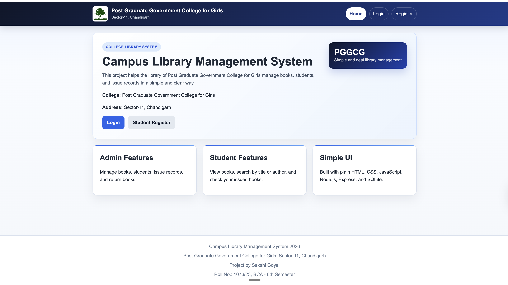

This page serves as the entry point of the system. It introduces the project and provides navigation options for login and registration.

## Screensort: 2 - Login Page

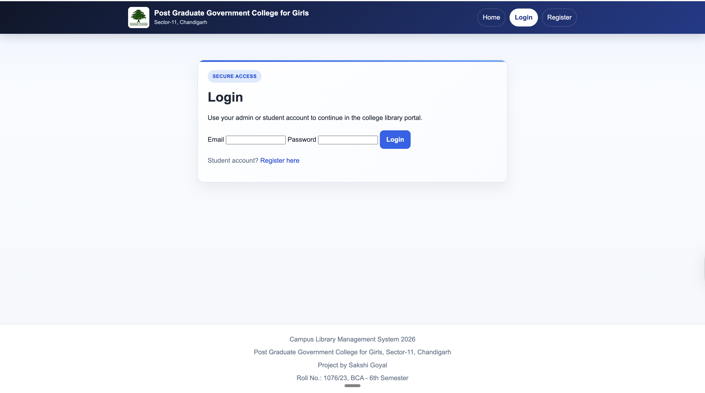

This page allows registered users to log in using their email and password. Based on the user role, the system redirects the user to the appropriate dashboard.

## Screensort: 3 - Registration Page


This page is used by students to create a new account. It collects academic and personal details needed for library registration.

## Screensort: 4 - Unauthorized Page

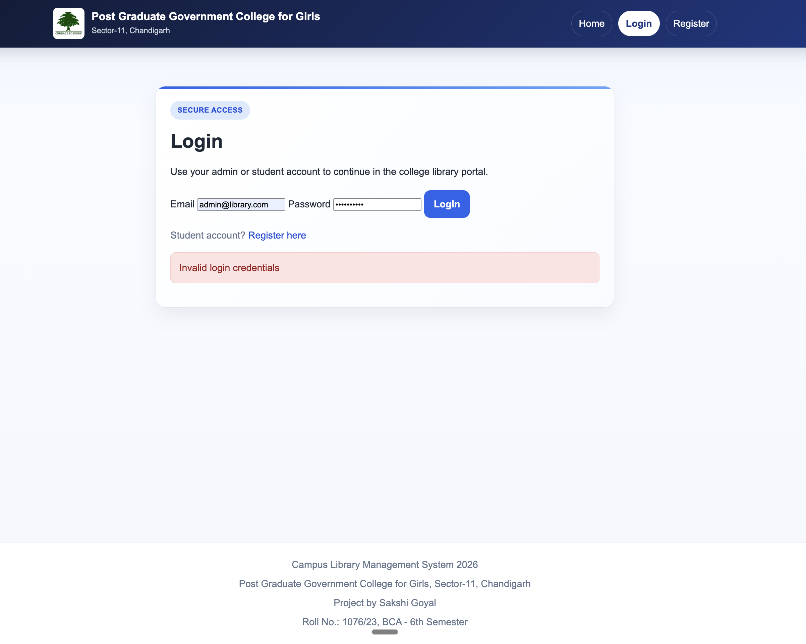

This page is displayed when a user tries to access a section without the required permission.

## Admin Screensorts

## Screensort: 5 - Book Not Found Page

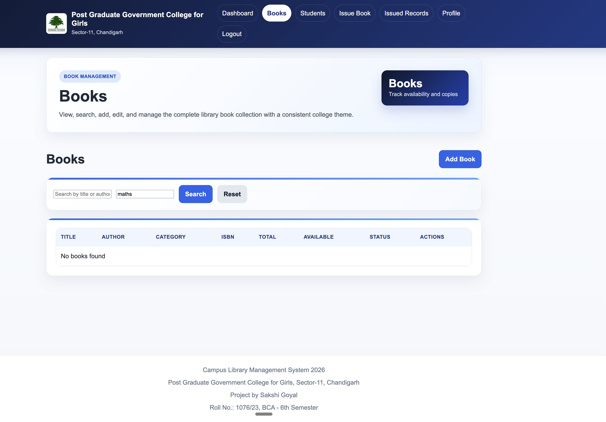

This page is shown in the admin section when a searched or requested book record is not found in the system.

## Screensort: 6 - Admin Dashboard


This page displays key summary information such as total books, total students, issued books, and available books. It gives the administrator a quick overview of library activity.

## Screensort: 7 - Book Management

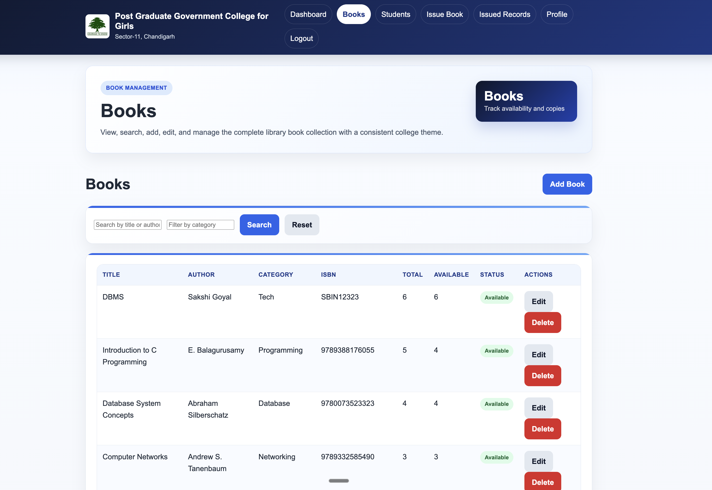

This page allows the administrator to add, view, search, edit, and delete book records. It is the main section for maintaining the library inventory.

## Screensort: 8 - Add Book Page

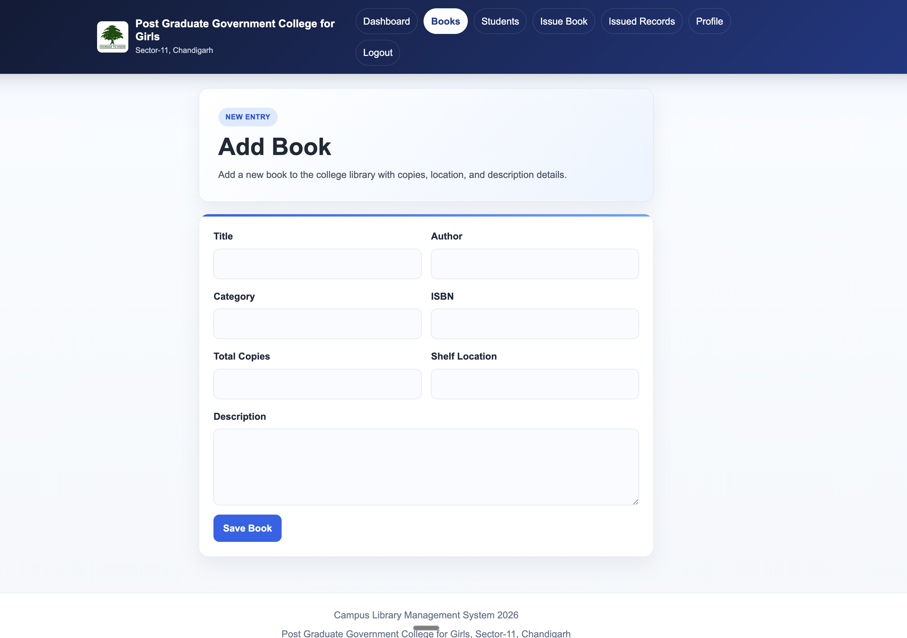

This page contains the form used by the administrator to add a new book into the system.

## Screensort: 9 - Edit Book Page


This page allows the administrator to modify the details of an existing book in the database.

## Screensort: 10 - Issue Book

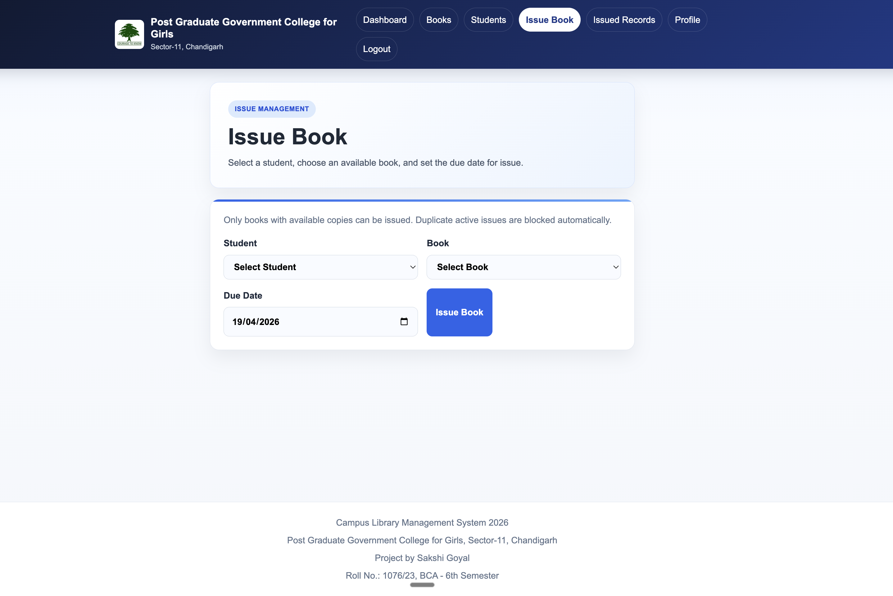

This page is used by the administrator to issue a selected book to a student by entering the required issue details and due date.

## Screensort: 11 - Issued Records Page

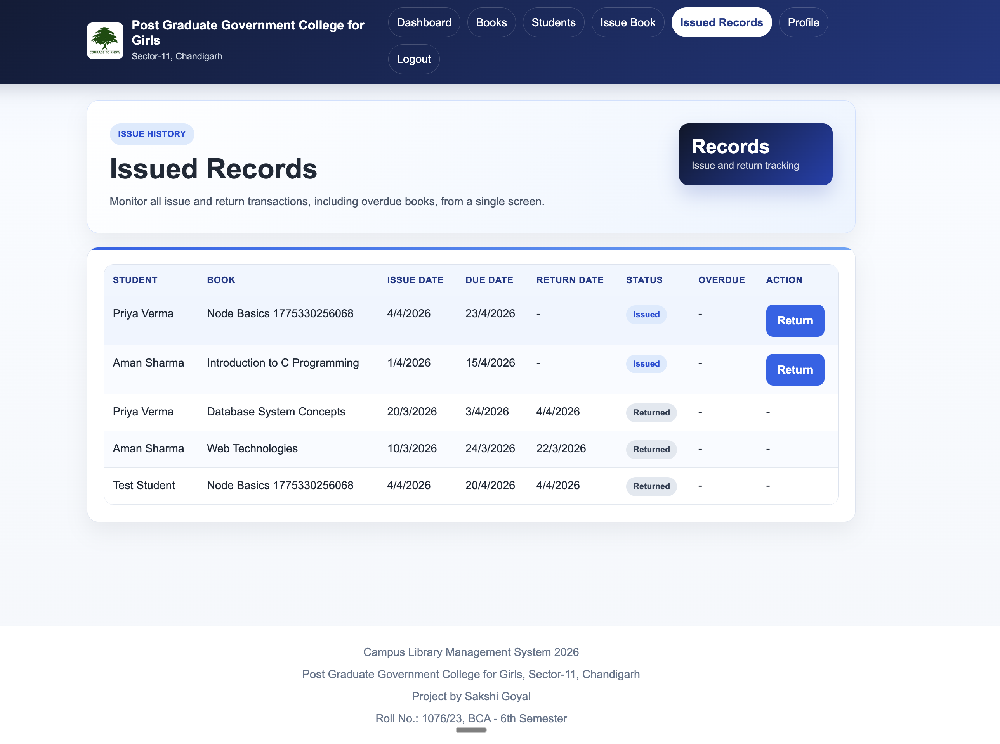

This page displays all issue and return records maintained by the system for administrative tracking.

## Screensort: 12 - Students Management Page

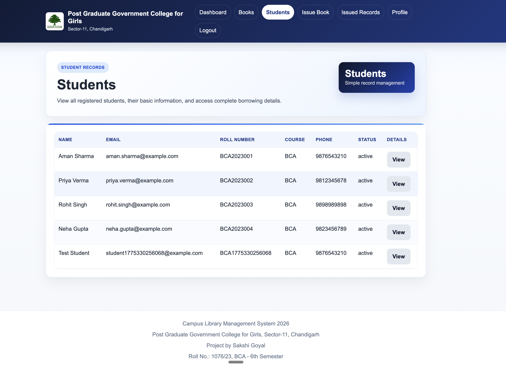

This page is used by the administrator to view the list of registered students and manage student-related records.

## Screensort: 13 - Student Details Page

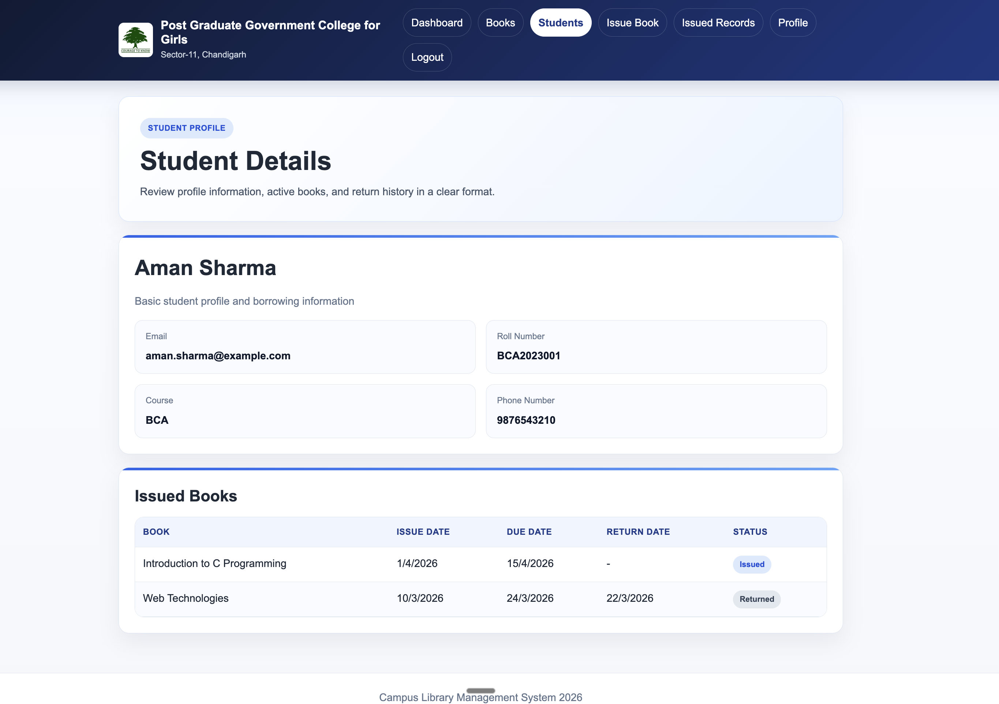

This page presents complete information of a selected student along with the related issue history.

## Student Screensorts

## Screensort: 14 - Student Dashboard

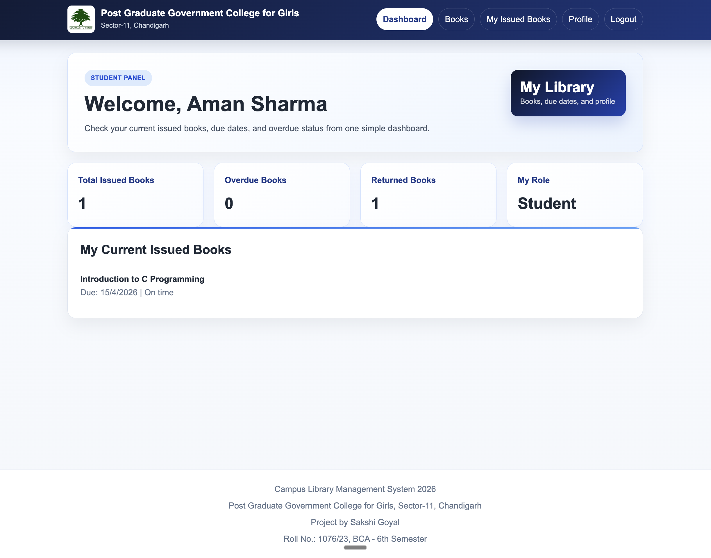

This page provides students with quick access to their library-related information. It acts as the central page for viewing books, issued records, and profile details.

## Screensort: 15 - Student Books Page


This page displays the list of books available to student users. It helps students search and review library books easily.

## Screensort: 16 - My Issued Books Page


This page shows the books issued to the currently logged-in student along with issue date, due date, and return status.

## Screensort: 17 - Book Details Page

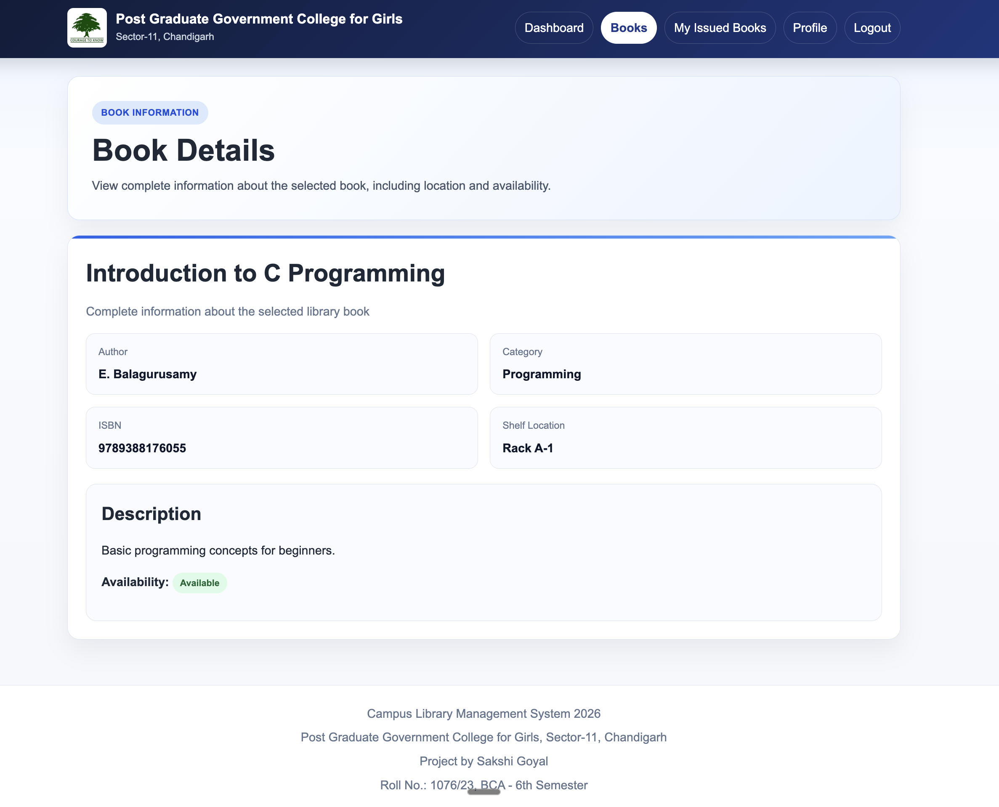

This page provides complete information about a selected book, including category, author, availability, and description.

## Screensort: 18 - Profile Page

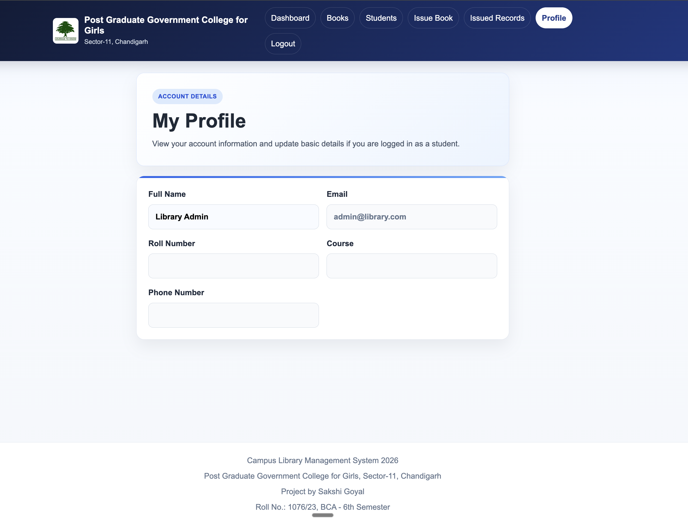

This page allows users to view and update their personal details maintained in the system.

---

# ADVANTAGES

- Efficient management of books, students, and issue records
- Reduced manual paperwork and administrative effort
- Faster search and retrieval of library information
- Improved accuracy in book issue and return operations
- Better tracking of due dates and issued books
- Separate access for admin and student users
- Easy to use and suitable for small academic institutions

---

# LIMITATIONS

- No mobile application version is available
- The system is designed for basic college-level use and limited scale
- Online fine payment facility is not included
- Email or SMS notifications are not implemented
- Advanced reporting and analytics features are limited
- The system currently depends on local deployment and setup

---

# FUTURE SCOPE

- Development of a mobile application for students and administrators
- Integration of online fine payment functionality
- Addition of email or SMS notifications for due dates and returns
- Implementation of advanced search, filter, and reporting features
- Barcode or QR-based book issue and return support
- Multi-library or department-wise expansion for larger institutions
- Improved dashboard analytics for better decision making

---

# CONCLUSION

The **Library Management System** developed in this project successfully demonstrates the practical implementation of a web-based application for managing library operations in an organized and efficient manner.

The system provides a clear and effective method for handling book records, student information, authentication, and issue-return processes. It reduces manual effort, improves record accuracy, and helps maintain proper control over library activities. By introducing separate modules for administrators and students, the project also ensures better usability and secure access to important functions.

During the development of this project, I gained valuable practical knowledge of web technologies such as HTML, CSS, JavaScript, Node.js, and Express.js, along with relational database concepts implemented through SQLite. The project also improved my understanding of database design, API handling, authentication, data validation, and integration between frontend and backend components.

Overall, this project strengthened my problem-solving skills and provided meaningful hands-on experience in designing, developing, and implementing a complete full-stack application suitable for real academic use.

---

# BIBLIOGRAPHY

- Node.js Official Documentation: https://nodejs.org/en/docs
- Express.js Official Documentation: https://expressjs.com
- MySQL Official Documentation: https://dev.mysql.com/doc/
- MDN Web Docs (HTML, CSS, JavaScript): https://developer.mozilla.org
- W3Schools Web Development Tutorials: https://www.w3schools.com
- GeeksforGeeks Computer Science Portal: https://www.geeksforgeeks.org
- Stack Overflow Developer Community: https://stackoverflow.com
- EJS Template Engine Documentation: https://ejs.co
- npm (Node Package Manager): https://www.npmjs.com
- MySQL Tutorial (W3Schools): https://www.w3schools.com/mysql/
- JavaScript Guide (MDN): https://developer.mozilla.org/en-US/docs/Web/JavaScript/Guide
- Express Routing Guide: https://expressjs.com/en/guide/routing.html
- Node.js File System Module: https://nodejs.org/api/fs.html
